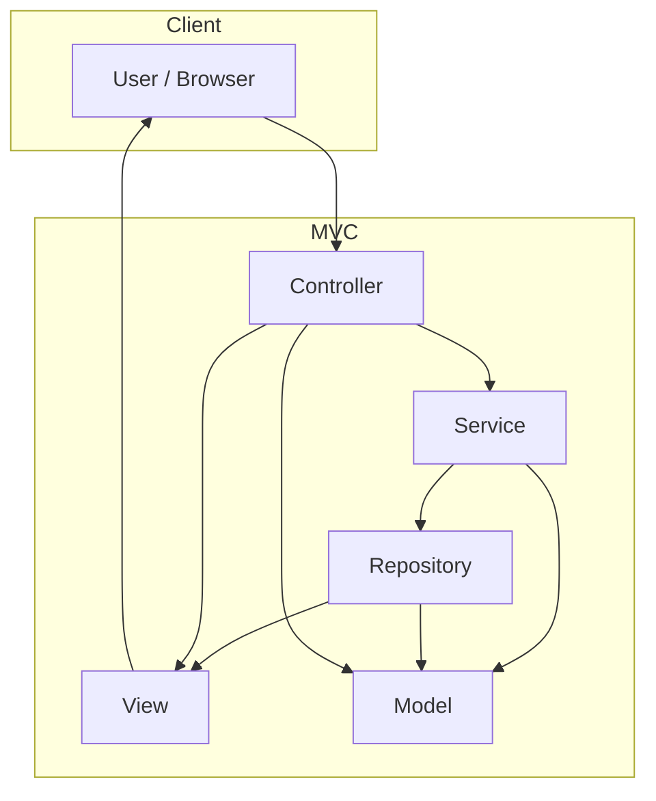

# Library MVC Application

This application is a web-based book rental system developed using **ASP.NET Core MVC**. It enables users to browse a collection of books, categorized by genre or type, and perform essential operations such as renting and returning books. Administrators can manage the library by adding new books, editing existing entries, assigning categories, and removing outdated records.

This project serves as a practical demonstration of how to implement separation of concerns using MVC architecture, repositories, and services within a single ASP.NET Core application.


---

##  How to Run the Application

### 1. Clone the repository

```bash
git clone https://github.com/patmat511/Library-MVC.git
cd Library-MVC
```

### 2. Configure the database connection

Edit the `appsettings.json` file and set your connection string:

```json
"ConnectionStrings": {
  "DefaultConnection": "Server=localhost;Database=LibraryDb;Trusted_Connection=True;TrustServerCertificate=True;"
}
```

### 3. Apply database migrations

```bash
dotnet ef database update
```

If you don’t have EF CLI installed:

```bash
dotnet tool install --global dotnet-ef
```

### 4. Run the application

```bash
dotnet run
``` 
